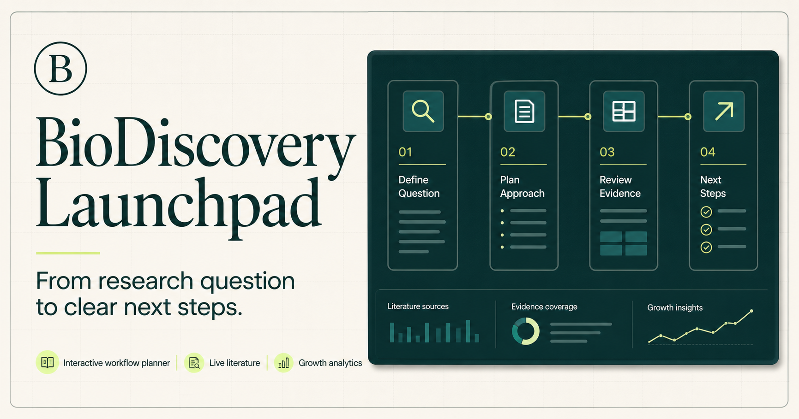
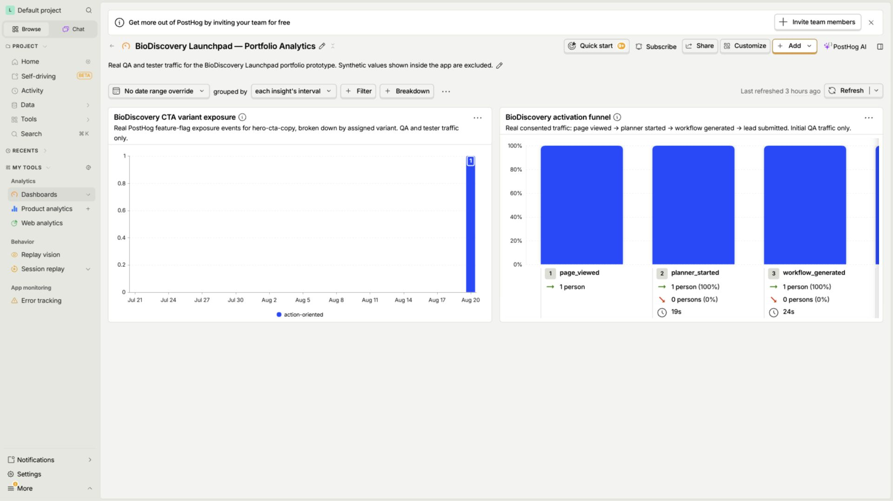

# BioDiscovery Launchpad



A personal project simulating the landing page and activation flow of an AI-assisted life-science product.

Users describe a research objective, choose their available input and desired output, and receive an explainable workflow with relevant literature context.

**Live demo:** [biodiscovery-launchpad.vercel.app](https://biodiscovery-launchpad.vercel.app/)

## Product simulation

- Responsive product landing page
- Four-step onboarding and workflow planner
- Live literature preview through the Europe PMC API
- Rules-based workflow generation and lead qualification
- PostHog event tracking and CTA feature flag

## Product analytics



_PostHog dashboard using controlled QA traffic to verify the analytics integration._

PostHog measures the core activation funnel with explicit user consent:

```text
page_viewed
→ planner_started
→ workflow_generated
→ lead_submitted
```

## Stack

- React and TypeScript
- Next.js
- PostHog JS
- Europe PMC REST API

## Run locally

Requires Node.js 22.13 or newer.

```bash
npm ci
cp .env.example .env.local
npm run dev
```

Add the PostHog project token and host to `.env.local` before running the portfolio validation:

```dotenv
NEXT_PUBLIC_POSTHOG_PROJECT_TOKEN=phc_your_project_token
NEXT_PUBLIC_POSTHOG_HOST=https://eu.i.posthog.com
```

```bash
npm run validate:portfolio
```

## Disclaimer

This is a product-interface prototype, not a scientific research engine. It does not perform or validate docking, structure prediction, ADMET, or other scientific computations.
